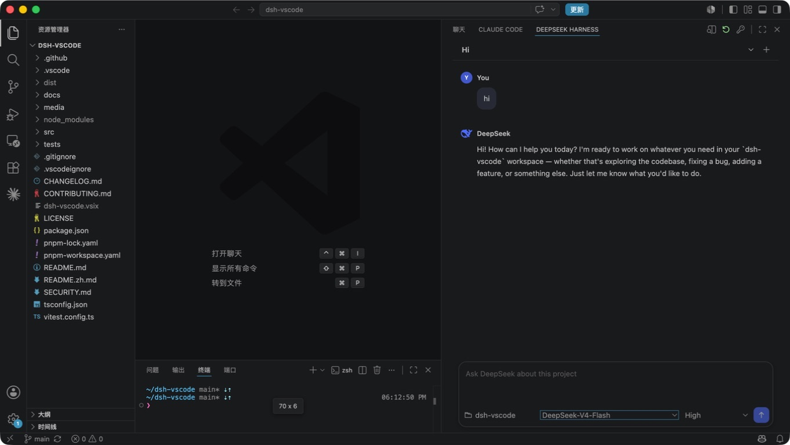

# DeepSeek Harness for VS Code

Use DeepSeek Harness as a coding assistant in the VS Code sidebar.

The goal is the same kind of workflow offered by Claude Code and Codex in VS Code: keep an assistant beside your editor while you work, with the current project already in context.

**English** | [简体中文](README.zh.md)

[](https://github.com/Lixxx1/dsh-vscode/actions/workflows/ci.yml)
[](LICENSE)


<p align="center">
  
</p>

## Features

- Chat with DeepSeek about the project currently open in VS Code.
- Keep the assistant visible in the right sidebar while editing code.
- Create new conversations or continue existing project sessions.
- Choose the Model and Reasoning Effort separately.
- Read streamed Markdown responses and expandable tool cards without leaving the editor.
- Review tool approvals and answer DeepSeek's follow-up questions in the conversation.
- Attach images to prompts, and stop running tasks directly from the sidebar.
- Open the same conversation in an editor tab when you need more space.

## Install

Install the official DeepSeek Harness CLI first:

```sh
npm install -g @deepseek-ai/dsh
```

Then build and install the extension:

```sh
git clone https://github.com/Lixxx1/dsh-vscode.git
cd dsh-vscode
corepack pnpm install --frozen-lockfile
corepack pnpm run check
corepack pnpm run package
code --install-extension dsh-vscode.vsix
```

Requires VS Code 1.100 or newer and Node.js `^22.19` or `>=24`.

## Use

1. Open a trusted project folder in VS Code.
2. Select **DeepSeek Harness** in the right sidebar. If it is hidden, find it under **Other Views**.
3. Use the key button to configure `DEEPSEEK_API_KEY`.
4. Choose a conversation, Model, and Reasoning Effort, then start working.

For implementation details, see [Architecture](docs/architecture.md). To contribute, read [CONTRIBUTING.md](CONTRIBUTING.md).

## License

[MIT](LICENSE)
