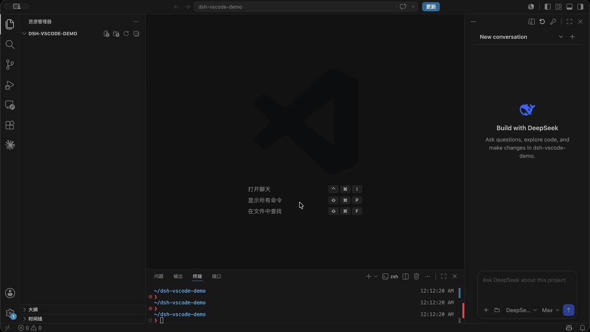

# DeepSeek Harness for VS Code

把 DeepSeek Harness 放到你真正写代码的地方。dsh-vscode 为 DSH 提供类似 Claude Code、Codex 的 VS Code 右侧边栏，并自动理解当前项目、文件和选区。

让 DeepSeek 直接阅读、修改和验证代码，不再需要在编辑器、终端和独立聊天窗口之间反复切换。

[English](README.md) | **简体中文**

[项目主页](https://lixxx1.github.io/dsh-vscode/) · [VS Code Marketplace](https://marketplace.visualstudio.com/items?itemName=lixxx1.dsh-sidebar)

[](https://github.com/Lixxx1/dsh-vscode/actions/workflows/ci.yml)
[](https://marketplace.visualstudio.com/items?itemName=lixxx1.dsh-sidebar)
[](LICENSE)


<p align="center">
  
</p>

## 功能

- **使用真实的 DSH runtime。** 项目会话、流式回复、工具调用、操作审批、后续问题和官方 `/` 命令都可以在 VS Code 侧边栏中完成。
- **直接在 VS Code 中扩展 DSH。** 搜索并安装社区 Tools、Skills、MCP、Memory 和 Agent Hook 插件；插件会加入官方 `web` profile，并在 DSH 重启后由官方 runtime 加载。
- **从正确的代码上下文开始。** DeepSeek 会获取当前工作区、正在查看的文件和选中代码；也可以通过 `@` 添加指定文件或文件夹，或使用 **Add Selection to Chat** 固定选区。
- **清楚控制每次会话。** 在输入框中切换 DSH 官方 Permission 和 Plan 模式，并分别选择 Model 与 Reasoning Effort。
- **在写代码的地方审阅改动。** Changed Files 按 Turn 分组并显示 `+/-` 行数，可使用 VS Code 原生 Diff Editor 查看，再对单个文件或全部改动执行 Keep 或安全 Revert。
- **在 DeepSeek 工作时保持控制。** 任务运行期间可以排队、编辑、删除或立即调整后续消息；如果 DeepSeek 即将修改包含未保存内容的文件，任务会在覆盖前停止。

## 安装

先安装官方 DeepSeek Harness CLI：

```sh
npm install -g @deepseek-ai/dsh
```

然后根据需要选择扩展版本：

### 发布版

在 VS Code 中打开**扩展**，搜索 **DSH Sidebar** 并点击**安装**；也可以直接从 [VS Code Marketplace](https://marketplace.visualstudio.com/items?itemName=lixxx1.dsh-sidebar) 安装。

### 最新开发版

如果想提前使用已经合并到 `main`、但尚未发布到 Marketplace 的功能，可以构建并安装最新 VSIX：

```sh
git clone https://github.com/Lixxx1/dsh-vscode.git
cd dsh-vscode
pnpm install --frozen-lockfile
pnpm run package
```

然后在 VS Code 命令面板中运行 **Extensions: Install from VSIX...**，选择生成的 `dsh-vscode.vsix`。开发版更新更快，稳定性可能不如 Marketplace 版本；之后拉取最新代码并重新构建 VSIX 即可更新。

需要 VS Code 1.100 或更新版本，以及 Node.js `^22.19` 或 `>=24`。

安装社区 runtime 插件还需要确保 `pnpm` 已加入 PATH。

## 使用

1. 在 VS Code 中打开一个受信任的项目文件夹。
2. 在右侧选择 **DeepSeek Harness**。如果没有显示，可以在 **其他视图** 中找到它。
3. 点击钥匙按钮配置 `DEEPSEEK_API_KEY`。
4. 选择 Permission 模式、Model 和 Reasoning Effort，然后开始工作。Shield 菜单用于切换 Permission 和 Plan 模式，输入 `/` 使用 DSH 官方命令，输入 `@` 添加文件或文件夹。
5. 点击侧边栏标题栏中的插件按钮，搜索、安装、查看或移除社区 runtime 插件。

## License

[MIT](LICENSE)
